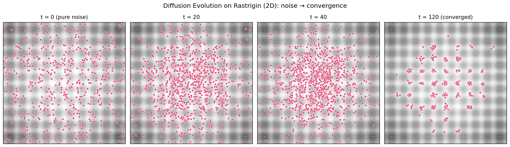

# Devol

[](https://pypi.org/project/devol/)
[](https://pypi.org/project/devol/)
[](https://github.com/LabStrangeLoop/devol/actions/workflows/ci.yml)
[](https://github.com/LabStrangeLoop/devol/blob/main/LICENSE)

**Diffusion Evolution** - What if evolution worked like image generation?

## What Is This?

Traditional evolutionary algorithms create new solutions by *copying and mutating* successful ones. Devol does something different: it starts with pure noise and *denoises* toward good solutions, guided by fitness.

The core idea: instead of asking "what should the children of good solutions look like?", we ask "given this random noise, what good solution could it have come from?"

This reframing gives us an algorithm that naturally transitions from broad exploration to precise optimization - without any special tuning.

**The intuition**: Imagine you're in a foggy room full of people, each standing at a different elevation. You can only see your immediate neighbors through the fog. To find the highest point, you don't just copy the person next to you - you look at everyone nearby, weight them by height, and move toward the weighted average. As the fog clears (denoising), your steps become smaller and more precise.



The population starts as pure noise spread across the search space (left). As denoising proceeds, the cloud organizes around the Rastrigin landscape's fitness peaks (center). At the end (right), individuals cluster on the global maximum at the origin *and* on neighbouring high-fitness modes — no explicit niching required. A full animation of the trajectory is [here](docs/images/denoising-trajectory.gif).

## Installation

```bash
pip install devol
```

Devol's core has a tiny footprint (numpy + pydantic + pydantic-yaml). Optional extras install the dependencies needed for demos and benchmarks:

```bash
pip install "devol[examples]"   # cartpole, MNIST, two-peaks (adds torch, gymnasium, matplotlib)
pip install "devol[benchmark]"  # grid-search benchmarks (adds matplotlib, rich, tqdm)
pip install "devol[dev]"        # contributor tooling (pytest, ruff, mypy, twine)
pip install "devol[all]"        # everything above
```

## Quick Start

```python
import numpy as np
from devol import DiffusionEvolution, DiffusionConfig

# Define what you're optimizing
def sphere(x: np.ndarray) -> float:
    """Simple sphere function - maximum at origin."""
    return -np.sum(x ** 2)

# Configure the algorithm
config = DiffusionConfig(
    population_size=128,
    num_steps=100,
    param_dim=10,
    sigma_m=0.5,
)

# Run evolution
algo = DiffusionEvolution(config, sphere)
algo.run(initial_population=None)

# Get results
best_solution, best_fitness = algo.get_best_individual()
print(f"Best fitness: {best_fitness:.6f}")
```

### Configuration Options

| Parameter | Description | Default |
|-----------|-------------|---------|
| `population_size` | Number of candidate solutions | 512 |
| `num_steps` | Denoising iterations | 50 |
| `param_dim` | Dimensionality of search space | (required) |
| `sigma_m` | Mutation scale [0, 1] | 1.0 |
| `schedule.type` | `linear`, `cosine`, or `ddpm` | `cosine` |
| `fitness.mapping` | How fitness converts to weights | `direct` |
| `fitness.temperature` | Sharpness of fitness weighting | 1.0 |

### Using YAML Configuration

```python
from devol import DiffusionEvolution
from devol.config import DiffusionConfig
from pydantic_yaml import parse_yaml_file_as

config = parse_yaml_file_as(DiffusionConfig, "config.yaml")
algo = DiffusionEvolution(config, your_fitness_function)
```

Example `config.yaml`:
```yaml
population_size: 256
num_steps: 200
param_dim: 32
sigma_m: 0.5
schedule:
  type: cosine
  epsilon: 0.0001
fitness:
  mapping: exponential
  temperature: 2.0
  normalize: min_max
```

## Benchmarks

The benchmark suite helps you understand how different configurations perform on challenging optimization landscapes.

### Why Benchmark?

Different problems favor different settings:
- **Multimodal landscapes** (many local optima): May need higher `sigma_m` and more steps
- **High-dimensional spaces**: May need larger populations
- **Smooth landscapes**: Can often use fewer steps with aggressive schedules

The benchmarks use the **Rastrigin function** - a notoriously difficult test case with a global optimum surrounded by a regular grid of local optima. If your configuration works on Rastrigin, it has a fighting chance on real problems.

### Running Benchmarks

```bash
uv run -m benchmark.main
```

This runs a grid search across:
- **Schedule types**: linear, cosine, ddpm
- **Population sizes**: 64, 128, 256
- **Steps**: 64, 128, 256, 512
- **Dimensions**: 8, 16, 32, 64
- **Mutation scales**: 0.2, 0.5, 0.8, 1.0

Results are saved to `benchmark_results/` with visualizations showing:
- Best fitness achieved per configuration
- How different schedules compare
- The effect of population size vs. steps tradeoffs

### Custom Benchmarks

```python
from benchmark import GridSearchRunner

def your_objective(x):
    # Your fitness function here
    return score

runner = GridSearchRunner(
    fitness_fn=your_objective,
    schedule_types=["cosine", "ddpm"],
    population_sizes=[128, 256],
    num_steps_list=[100, 200],
    param_dims=[16],
    sigma_m_values=[0.5, 0.8],
    seeds=[42, 123],
)

results = runner.run(verbose=True)
```

The runner uses multiprocessing to parallelize experiments across CPU cores.

---

## How It Actually Works

If you're curious about the mechanics, here's the full story.

### The Diffusion Perspective

The key insight: if you add enough random noise to any population of solutions, they all become indistinguishable - just random static. The magic is in *reversing* that process.

- **Forward process**: Take good solutions and gradually add noise until they're unrecognizable
- **Reverse process**: Start with pure noise and gradually remove it, guided by fitness

The reverse process is where evolution happens. At each step, we ask: "Given this noisy solution, what did the *clean* solution probably look like?" And we answer using two signals:

1. **Fitness**: Better solutions should be more likely origins
2. **Proximity**: Solutions that are closer in parameter space are more relevant

This is captured in a beautifully simple equation. To estimate what a noisy point `xₜ` originally was, we compute a weighted average:

```
x̂₀ = Σ (fitness_weight × proximity_weight × candidate) / normalization
```

Each candidate solution contributes based on both how good it is *and* how close it is to the noisy observation. This creates a kind of "gravitational pull" toward high-fitness regions, but filtered through local structure.

### Why Proximity Matters

The proximity weighting is the secret sauce. In traditional evolution, a mutation in New York affects a solution in Tokyo with the same probability. In diffusion evolution, the influence is local - solutions only "see" their neighbors.

This means:
- **Early iterations** (high noise): Large-scale structure emerges, populations cluster toward promising regions
- **Late iterations** (low noise): Fine-grained optimization, solutions converge precisely to peaks

The algorithm naturally transitions from exploration to exploitation without any explicit scheduling.

### The Algorithm Step by Step

Here's what happens at each denoising step:

**Step 1: Estimate the clean solution**

For each noisy solution `xₜ`, we estimate what it was before noise was added:

```
x̂₀ = (1/Z) Σ g[f(x)] × N(xₜ; √αₜ·x, 1-αₜ) × x
```

where:
- `g[f(x)]` is a fitness-based weight (fitter solutions contribute more)
- `N(...)` is a Gaussian that weights by proximity
- `Z` normalizes everything

**Step 2: Compute the predicted noise**

```
ε̂ = (xₜ - √αₜ · x̂₀) / √(1-αₜ)
```

This is the noise we think was added to get from `x̂₀` to `xₜ`.

**Step 3: Take the evolution step**

```
xₜ₋₁ = √αₜ₋₁ · x̂₀ + direction_term · ε̂ + σₜ · noise
```

We move toward our estimate of the clean solution, partially preserving the predicted noise direction, and add fresh stochasticity controlled by `σₜ`.

### The Noise Schedule

The parameter `αₜ` controls how much "signal" remains at step `t`:
- `αₜ = 1`: Pure signal, no noise
- `αₜ = 0`: Pure noise, no signal

The schedule (linear, cosine, or DDPM) determines how quickly we transition. Cosine schedules spend more time in the middle range where interesting structure emerges.

## References

This implementation is based on:

> **Diffusion Models are Evolutionary Algorithms**
> arXiv:2410.02543
> https://arxiv.org/abs/2410.02543

The paper establishes the theoretical connection between diffusion models and evolutionary computation, showing that the iterative denoising process can be interpreted as fitness-guided evolution with proximity-aware selection.
